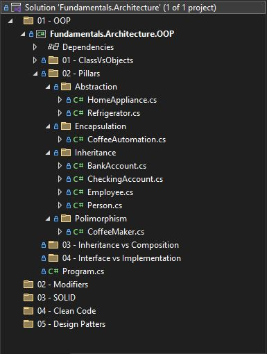

## Pilares da Programação Orientada a Objetos (POO)
Neste módulo, exploraremos a Programação Orientada a Objetos (POO), um conceito fundamental na engenharia de software. Você provavelmente já teve contato com POO na faculdade, em cursos de programação ou até mesmo por conta própria, e pode considerá-la um conceito simples.

No entanto, aqui iremos aprofundar o estudo com seriedade, analisando suas bases, aplicações práticas e melhores práticas, garantindo uma compreensão sólida e avançada da Programação Orientada a Objetos.

### A Origem da Programação Orientada a Objetos
O termo Programação Orientada a Objetos (POO) foi criado por Alan Kay, o mesmo criador da linguagem Smalltalk. Embora esse paradigma tenha sido desenvolvido anteriormente, sua popularização ocorreu principalmente na década de 1990, consolidando-se como um dos modelos mais utilizados no desenvolvimento de software.

A POO é um paradigma essencial no desenvolvimento de software moderno. Ela permite organizar o código de forma intuitiva, reutilizável e escalável. No C#, a POO é amplamente utilizada para desenvolver aplicações robustas e modulares.

### Os Pilares Fundamentais da Programação Orientada a Objetos
- **Estado e comportamento** (definição dos atributos e métodos dos objetos).
- **Abstração** (ocultar detalhes internos e expor apenas o essencial).
- **Herança** (compartilhamento de características entre classes).
- **Polimorfismo** (capacidade de um método ter diferentes implementações).
- **Encapsulamento** (restringir o acesso direto aos dados internos de um objeto).

### A Importância da POO no Mercado
Dominar os princípios da Orientação a Objetos é essencial para:
- Aplicar boas práticas de design de código e padrões arquiteturais.
- Trabalhar com .NET, Java e outros frameworks populares.
- Ter um diferencial competitivo no mercado de trabalho.
- Passar por entrevistas técnicas e explicar conceitos com exemplos claros.
- Implementar design patterns e estilos arquiteturais corretamente.

Embora existam outras abordagens, como a programação funcional, a maioria das empresas ainda utiliza POO em grande escala. Se você deseja ter oportunidades no mercado, é essencial dominar esses conceitos.

### Baixo Acoplamento e Alta Coesão: Conceitos Essenciais
Dois conceitos fundamentais na POO são baixo acoplamento e alta coesão. Muitas pessoas mencionam esses termos sem realmente entendê-los, então vamos esclarecer.

### O que é Acoplamento?
O acoplamento refere-se ao grau de dependência entre objetos. Se um objeto depende diretamente de outro, qualquer alteração pode impactar ambos, gerando fragilidade no código.

### Exemplo de alto acoplamento:
Quando uma classe instancia diretamente outra classe dentro dela, ou quando a herança é mal utilizada, causando forte dependência entre os objetos.

**Se um objeto muda, o outro também é impactado.**

### O que é Coesão?
A coesão representa o grau de responsabilidade única de um objeto. Um sistema com alta coesão possui módulos independentes, cada um executando uma única responsabilidade sem depender fortemente de outros.

### Exemplo de alta coesão:
Classes trabalhando lado a lado, cada uma cumprindo seu papel específico, sem dependências desnecessárias.<br />

**Se um objeto muda, os outros continuam funcionando normalmente.**

### Acoplamento vs. Coesão
| Conceito     | Definição                                      | Impacto no Código                                                 |
|--------------|------------------------------------------------|-------------------------------------------------------------------|
| Acoplamento  | Dependência direta entre objetos               | Torna o código rígido e frágil, dificultando a manutenção.        |
| Coesão       | Cada objeto executa uma única responsabilidade | Facilita a manutenção e reuso, tornando o código mais organizado. |

### Aplicando na Prática
No desenvolvimento Orientado a Objetos, devemos sempre buscar baixo acoplamento e alta coesão. Isso melhora a manutenibilidade, reutilização e escalabilidade do código.

Agora que entendemos esses princípios fundamentais, vamos explorar em detalhes cada um dos pilares da POO! 

## Estado e comportamento 

Agora vamos aprofundar ainda mais os conceitos da Programação Orientada a Objetos (POO). A partir deste ponto, utilizaremos um modelo prático, um projeto especialmente desenvolvido para demonstrar exemplos reais de cada conceito abordado. 

Para acompanhar e praticar os exemplos, você pode fazer o download do projeto diretamente no meu repositório do GitHub: 

Repositório no GitHub: 
https://github.com/jeffreysSharp/fundamentos-arquitetura-software 
 
Através desse projeto, iremos explorar os fundamentos da POO na prática, garantindo um aprendizado mais dinâmico e aplicável ao mercado de trabalho. 

## Estrutura do projeto
Este projeto segue a estrutura apresentada na imagem abaixo, proporcionando uma organização clara e modular para facilitar o entendimento e a implementação dos conceitos abordados. 



Com este projeto base, você poderá acompanhar os módulos, experimentar os conceitos na prática, realizar testes e explorar diferentes implementações.

### Definições de Classes
A classe é um dos conceitos fundamentais da Programação Orientada a Objetos (POO). Em C#, classes servem como modelos para criar objetos, encapsulando atributos (dados) e métodos (comportamentos).

### O que é uma Classe?
Uma classe é uma estrutura de código que define um conjunto de propriedades (atributos) e comportamentos (métodos) de um objeto. Ela funciona como um molde para a criação de instâncias (objetos) que compartilham as mesmas características e funcionalidades.

### Estrutura Básica de uma Classe
```
public class ClassName
{
    // Atributos (Propriedades)
    public int Property1 { get; set; }
    public string Property2 { get; set; }

    // Construtor
    public ClassName(int property1, string property2)
    {
        Property1 = property1;
        Property2 = property2;
    }

    // Método
    public void Method()
    {
        Console.WriteLine("Executando método!");
    }
}

```

### Características das Classes
- Encapsulam atributos e comportamentos.
- Possuem modificadores de acesso (public, private, protected, etc.).
- Podem ter construtores para inicialização de objetos.
- Podem herdar de outras classes (herança).
- Podem implementar interfaces para definir contratos de comportamento.

### Criando uma Classe House (Casa)                
Vamos criar uma classe House, que representará uma casa com atributos (cor, número de quartos, tamanho) e métodos (abrir porta, fechar porta, exibir informações).

```
public class House
{
    // Atributos (Propriedades)
    public string Color { get; set; }
    public int NumberOfRooms { get; set; }
    public double Size { get; set; } // Tamanho em metros quadrados

    // Construtor
    public House(string color, int numberOfRooms, double size)
    {
        Color = color;
        NumberOfRooms = numberOfRooms;
        Size = size;
    }

    // Métodos
    public void OpenDoor()
    {
        Console.WriteLine("A porta foi aberta!");
    }

    public void CloseDoor()
    {
        Console.WriteLine("A porta foi fechada!");
    }

    public void DisplayInfo()
    {
        Console.WriteLine($"Casa de cor {Color}, com {NumberOfRooms} quartos e {Size}m².");
    }
}

```

### Criando e Utilizando um Objeto da Classe House
Agora, vamos instanciar um objeto da classe House e chamar seus métodos.

```

class Program
{
    static void Main()
    {
        // Criando um objeto da classe House
        House myHouse = new House("Azul", 3, 120.5);
        
        // Exibindo informações
        myHouse.DisplayInfo();
        
        // Abrindo e fechando a porta
        myHouse.OpenDoor();
        myHouse.CloseDoor();
    }
}

```

**Saída Esperada:**

```
Casa de cor Azul, com 3 quartos e 120.5m².
A porta foi aberta!
A porta foi fechada!

```

### Construtores e Sobrecarga de Métodos
Em C#, uma classe pode ter múltiplos construtores (sobrecarga) para permitir diferentes formas de inicialização.

```

public class House
{
    public string Color { get; set; }
    public int NumberOfRooms { get; set; }
    public double Size { get; set; }

    // Construtor padrão
    public House()
    {
        Color = "Branco";
        NumberOfRooms = 2;
        Size = 80;
    }

    // Construtor com parâmetros
    public House(string color, int numberOfRooms, double size)
    {
        Color = color;
        NumberOfRooms = numberOfRooms;
        Size = size;
    }
}

```

Agora podemos criar uma casa com valores padrões ou definir atributos personalizados.

```

House house1 = new House();
House house2 = new House("Vermelha", 4, 150);

```

Os modificadores de acesso controlam a visibilidade dos membros de uma classe. Os principais são:

| Modificador | Descrição                                                                 |
|-------------|---------------------------------------------------------------------------|
| public      | Acesso permitido de qualquer lugar.                                       |
| private     | Acesso permitido apenas dentro da classe.                                 |
| protected   | Acesso permitido apenas na classe e subclasses.                           |
| internal    | Acesso permitido apenas dentro do mesmo Assembly.                         |

**Exemplo de private e public:**

```
public class House
{
    private bool isDoorOpen;
    
    public void OpenDoor()
    {
        isDoorOpen = true;
        Console.WriteLine("Porta aberta!");
    }
}

```

**isDoorOpen é privado, ou seja, só pode ser acessado dentro da própria classe.**

### Conclusão
Agora você conhece tudo sobre Classes em C#!
- Entendeu o conceito e a estrutura de uma classe.
- Viu um exemplo prático com a classe House.
- Aprendeu sobre modificadores de acesso, construtores e métodos.

As classes são a base da Programação Orientada a Objetos (POO), e entender seu funcionamento é essencial para construir sistemas organizados, escaláveis e eficientes!

## Herança
A herança é um dos princípios fundamentais da Programação Orientada a Objetos (POO). Ela permite que uma classe (denominada classe derivada ou subclasse) herde atributos e comportamentos de outra classe (denominada classe base ou superclasse). No C#, a herança é usada para promover o reuso de código e criar hierarquias de classes mais organizadas. 

Isso promove reutilização de código, facilita a manutenção e melhora a organização do sistema. 

### Definição de Herança 
No C#, a herança é implementada através do operador dois-pontos (**:**) <br />
A classe derivada herda todos os membros públicos e protegidos da classe base, mas não os membros privados. 

**Sintaxe Básica**<br />
```
// Classe base
public class Person
{
    public string Name { get; set; }
    public int Age { get; set; }
    
    public void Introduce()
    {
        Console.WriteLine($"Meu nome é {Name} e eu tenho {Age} anos.");
    }
}

// Classe derivada
public class Employee : Person
{
    public string Position { get; set; }
    public decimal Salary { get; set; }
    
    public void Work()
    {
        Console.WriteLine($"{Name} está trabalhando como {Position}.");
    }
}

// Usage
var employee = new Employee
{
    Name = "Jeferson Almeida",
    Age = 43,
    Position = "Desenvolvedor Full Stack",
    Salary = 10000
};

employee.Introduce();
employee.Work();

```

**Modificadores de Acesso na Herança**<br />
Os modificadores de acesso controlam quais membros da classe base podem ser acessados pelas subclasses:

- public → Acessível de qualquer lugar.
- protected → Acessível apenas pela classe base e classes derivadas.
- private → Não acessível pelas classes derivadas.
- internal → Acessível apenas dentro do mesmo assembly.
- protected internal → Acessível dentro do mesmo assembly ou por herança.

**Exemplo de uso de protected:** <br />
```
public class BankAccount
{
    public string Owner { get; set; }
    protected decimal Balance { get; set; }
    
    public void Deposit(decimal amount)
    {
        Balance += amount;
    }
}

public class CheckingAccount : BankAccount
{
    public void ShowBalance()
    {
        Console.WriteLine($"Saldo atual: {Balance}"); // Permitido desde que o saldo esteja protegido
    }
}

```

### Herança e Construtores
A classe base pode conter um construtor, e a classe derivada pode chamá-lo utilizando base(...).

```

public class Person
{
    public string Name { get; set; }
    public int Age { get; set; }
    
    public Person(string name, int age)
    {
        Name = name;
        Age = age;
    }
}

public class Employee : Person
{
    public string Position { get; set; }
    
    public Employee(string name, int age, string position) : base(name, age)
    {
        Position = position;
    }
}

```

### Herança e Classes Abstratas
As classes abstratas são utilizadas quando queremos definir uma estrutura base que não pode ser instanciada diretamente. Em C#, usamos abstract.

```
public abstract class Animal
{
    public abstract void MakeSound(); // Método abstrato que deve ser implementado
}

public class Dog : Animal
{
    public override void MakeSound()
    {
        Console.WriteLine("Woof Woof!");
    }
}

```

### Vantagens da Herança
✅ Reuso de código.<br />
✅ Melhoria na organização das classes.<br />
✅ Facilidade de manutenção.<br />
✅ Permite a criação de estruturas hierárquicas flexíveis.<br />

### Desvantagens da Herança
⚠️ Pode introduzir acoplamento excessivo entre classes.<br />
⚠️ Pode levar a estruturas complexas e difíceis de manter.<br />
⚠️ Pode ser ineficiente em certos cenários onde composição seria mais adequada.<br />

### Conclusão
A herança é uma ferramenta poderosa na POO, mas deve ser usada com moderação. Em cenários complexos, muitas vezes a composição é preferível. No DDD, a herança é utilizada para criar abstrações como entidades base e agregações.

## Abstração 
Neste módulo, abordaremos abstração, um dos pilares fundamentais da Programação Orientada a Objetos (POO). A abstração está diretamente relacionada à herança, pois permite definir um conjunto de estado e comportamento que serve como base para diversas especializações. 

### Entendendo a Abstração 

A ideia central da abstração na POO é fornecer uma superclasse que possa ser reutilizada por várias classes especializadas. No exemplo abaixo, temos a classe HomeAppliance: 

```

public abstract class HomeAppliance
{
    public string Name { get; }
    public int Voltage { get; }

    public HomeAppliance(string name, int voltage)
    {
        Name = name;
        Voltage = voltage;
    }

    public abstract void TurnOn();
    public abstract void TurnOff();
}

```

Ao modelar essa classe, já pensamos no propósito dela como superclasse para outras classes especializadas. No entanto, ao projetar a abstração, não forçamos um comportamento específico. Cada subclasse que herdar de HomeAppliance será responsável por implementar os métodos abstratos TurnOn() e TurnOff(), garantindo a especialização do comportamento.

### Métodos e Classes Abstratas
No código acima, declaramos os métodos TurnOn() e TurnOff() como abstratos, utilizando a palavra-chave abstract. Isso significa que:<br />

✅ A classe base não implementa esses métodos, apenas os declara.<br />
✅ As classes que herdarem de HomeAppliance devem fornecer suas próprias implementações.<br />
✅ A assinatura do método (modificador de acesso, retorno e parâmetros) deve ser mantida pelas subclasses.<br />

Isso garante que todas as subclasses de HomeAppliance terão os métodos TurnOn() e TurnOff(), mas com implementações específicas para cada tipo de eletrodoméstico.<br />

### O Papel da Classe Abstrata
Além dos métodos abstratos, a própria classe HomeAppliance é marcada como abstrata (abstract). Isso significa que:<br />

🚫 Ela não pode ser instanciada diretamente.<br />
✅ Só pode ser usada como base para outras classes.<br />

Ou seja, o código abaixo não funcionaria:

```
HomeAppliance appliance = new HomeAppliance("Geladeira", 220); // Erro: não pode ser instanciada

```

**Já a seguinte implementação seria válida:**

```

public class Refrigerator : HomeAppliance
{
    public Refrigerator(string name, int voltage) : base(name, voltage) { }

    public override void TurnOn() => Console.WriteLine($"{Name} está ligada.");
    public override void TurnOff() => Console.WriteLine($"{Name} está desligada.");
}

```
**Agora podemos instanciar um Refrigerator, garantindo que ele siga o modelo de HomeAppliance:**

```
Refrigerator fridge = new Refrigerator("Geladeira", 220);
fridge.TurnOn(); // Saída: Geladeira está ligada.

```

Conclusão
A abstração permite criar modelos genéricos que podem ser especializados por outras classes, tornando o código mais organizado, reutilizável e flexível. Se seu objetivo é criar uma arquitetura bem estruturada, a abstração, combinada com herança, polimorfismo e encapsulamento, é essencial para um código limpo e escalável.

### Resumo:
- Superclasse abstrata define comportamento comum para várias classes.
- Métodos abstratos forçam a implementação específica em subclasses.
- Classes abstratas não podem ser instanciadas diretamente.
- Abstração é a base para polimorfismo e encapsulamento.

## Polimorfismo 
Neste módulo, abordaremos polimorfismo, um dos pilares essenciais da Programação Orientada a Objetos (POO). O próprio termo "polimorfismo" vem do grego: 

- "Poli" → pluralidade, múltiplos
- "Morfismo" → formas ou comportamentos 

Ou seja, polimorfismo significa que um mesmo conceito pode assumir diferentes comportamentos. Abaixo, temos um exemplo com a classe CoffeeMaker, que herda da classe HomeAppliance.<br /> 

**Exemplo de polimorfismo** 
```
 public class CoffeeMaker : HomeAppliance
 {
     public CoffeeMaker(string name, int voltage)
         : base(name, voltage) { }

     public CoffeeMaker() 
         : base("Cafeteira", 110) { }

     public override void TurnOn() => Console.WriteLine($" {Name} está ligada, verificando recipiente de água...");        

     public override void TurnOf() =>  Console.WriteLine($" {Name} está desligada, resfriando o aquecedor...");
     
     private static void HeatWater() => Console.WriteLine($" Aquecendo a água...");

     private static void GrindingGrains() => Console.WriteLine($" Moendo os grãos...");
     private static void FinalizingProcess() => Console.WriteLine($" O seu café está pronto!");

     public void PrepareCoffee()
     {
         Test();
         TurnOn();            
         HeatWater();
         GrindingGrains();
         FinalizingProcess();
         TurnOf();
     }
 }

```

**Polimorfismo no Construtor** <br />

Quando herdamos de HomeAppliance, somos obrigados a fornecer nome e voltagem para a classe base, pois esses dados são exigidos pelo seu construtor. Podemos criar um construtor padrão que atribua valores automáticos, como "Forno" e voltagem 220V, ou permitir que o usuário informe os valores. Isso exemplifica polimorfismo no construtor, onde temos diferentes formas de instanciar o mesmo objeto. 

**Encapsulamento e Orquestração de Processos**<br />

Na CoffeeMaker, temos três métodos principais:<br /> 

- HeatWater() → Aquece a água.
- GrindingGrains() → Moagem dos grãos.
- PrepareCoffee() → Orquestra os dois métodos anteriores. 

Os dois primeiros são privados, pois fazem parte do funcionamento interno da CoffeeMaker. O método PrepareCoffee() orquestra o fluxo do processo. Essa abordagem exemplifica encapsulamento, garantindo que HeatWater() e GrindingGrains() sejam usados apenas dentro da classe CoffeeMaker. 

**Override e Sobrescrita de Métodos**<br /> 

Outro aspecto essencial do polimorfismo é o uso da palavra-chave override. Quando sobrescrevemos um método da classe base HomeAppliance, estamos redefinindo seu comportamento na classe derivada CoffeeMaker. 

Isso é obrigatório para métodos abstratos. Se HomeAppliance definir: 

```
 public abstract void TurnOn(); 

 public abstract void TurnOff(); 

```

Então todas as classes que herdarem dela devem sobrescrever esses métodos. Caso não o façam, o código nem compilará, garantindo que cada especialização tenha um comportamento adequado. 

**Métodos Virtuais vs. Métodos Abstratos**<br />

Agora, suponha que HomeAppliance tenha um método Test(), mas sem ser abstrato: 

 ```
 public void Test()
 { 
    Console.WriteLine("Testando equipamento..."); 
 } 
 ```
 
**Nesse caso:**<br />  

- Ele já possui uma implementação padrão. 
- Todas as subclasses herdam esse método automaticamente. 
- Ele não pode ser sobrescrito (não é permitido override).

**Agora, se adicionarmos virtual:**<br /> 

 ```
 public virtual void Test()
 { 
    Console.WriteLine("Testando equipamento..."); 
 } 
 
 ```

**A classe derivada pode sobrescrevê-lo, se desejar:**<br /> 

```

 public override void Test()
 { 
    Console.WriteLine("Testando a cafeteira antes do uso..."); 
 } 


```

Isso mostra outro tipo de polimorfismo, onde o comportamento de um método pode ser herdado e modificado conforme necessário. 

**Exemplo de Polimorfismo Aplicado**<br />

Ao implementar TurnOn() e TurnOff(), cada classe pode ter um comportamento diferente: 

 
```
 public override void TurnOn()
 { 
    if (WaterTankIsEmpty()) 
    { 
        Console.WriteLine("Atenção: Reabasteça o reservatório de água!"); 
    } 
    else
    { 
        Console.WriteLine("Ligando a cafeteira..."); 
    }
 } 

 public override void TurnOff()
 { 
    Console.WriteLine("Desligando a cafeteira e resfriando o aquecedor..."); 
 } 

```

Dessa forma, HomeAppliance assume diferentes comportamentos dependendo de quem a está especializando, um dos principais conceitos do polimorfismo. 

**Conclusão** <br /> 

Polimorfismo permite que um mesmo método tenha diferentes comportamentos. 

- Métodos abstratos obrigam a sobrescrita (override). 
- Métodos virtuais podem ou não ser sobrescritos. 
- Construtores podem ser polimórficos (permitindo diferentes formas de instanciar uma classe).
- Encapsulamento e herança trabalham juntos no polimorfismo. 

**Prática Recomendada:**<br /> 

O conceito de polimorfismo pode ser desafiador no início. Para dominá-lo:  

- Crie diferentes cenários de herança e sobrescrita. 
- Experimente métodos abstratos e virtuais. 
- Teste diferentes formas de instanciar objetos. 

Quanto mais prática, maior será seu domínio sobre esse pilar fundamental da POO! 

## Encapsulamento

Neste módulo, abordaremos encapsulamento, um dos princípios fundamentais da Programação Orientada a Objetos (POO). O encapsulamento consiste em ocultar a implementação interna de uma classe, expondo apenas o necessário por meio de métodos públicos, enquanto mantém a lógica interna protegida com métodos privados. 

**Exemplo de Encapsulamento**<br /> 
```

public class CoffeeAutomation
{
    public void ServingCoffee()
    {
        var coffeeMaker = new CoffeeMaker();
        coffeeMaker.TurnOn();
        coffeeMaker.PrepareCoffee();
        coffeeMaker.TurnOff();
    }
}

```

No exemplo acima, a classe CoffeeAutomation contém o método público ServingCoffee(), que automatiza o processo de servir café. Esse método:

- Cria uma instância de CoffeeMaker
- Chama os métodos TurnOn(), PrepareCoffee() e TurnOff()
- Encapsula o processo de preparar café, ocultando os detalhes internos

Quem utiliza ServingCoffee() não precisa saber como o café é preparado internamente, apenas invoca o método para que a automação aconteça.

**Encapsulamento dentro da Classe CoffeeMaker**<br />

Dentro da classe CoffeeMaker, o método PrepareCoffee() também encapsula detalhes internos:

```
public void PrepareCoffee()
{
    Test();
    HeatWater();
    GrindingGrains();
    FinalizingProcess();
    TurnOff();
}

private void HeatWater() { /* Lógica de aquecimento da água */ }
private void GrindingGrains() { /* Lógica de moagem dos grãos */ }

```
Os métodos HeatWater() e GrindingGrains() são privados, o que significa que:

- Não podem ser chamados diretamente de fora da classe CoffeeMaker
- São utilizados apenas dentro da própria classe
- O encapsulamento evita que sejam chamados fora da ordem correta

Isso impede, por exemplo, que HeatWater() seja chamado sem necessidade, o que poderia gerar um mau funcionamento na cafeteira. O mesmo vale para GrindingGrains(), que só deve ser acionado no momento adequado do processo.

### O Conceito da "Caixa Preta"

Encapsulamento pode ser entendido como um sistema de caixa preta: você interage com uma interface pública
 (ServingCoffee()), mas não precisa saber como os métodos internos funcionam.

**Isso traz benefícios importantes:** <br />

- Segurança → Evita chamadas erradas que poderiam comprometer o sistema.
- Facilidade de manutenção → A implementação pode ser alterada sem afetar quem usa a classe.
- Melhor organização → Separação clara entre interface pública e lógica interna.

### Encapsulamento e Modificadores de Acesso

Os modificadores de acesso são essenciais para definir quais partes do código devem ser visíveis ou ocultas. Abaixo, uma tabela com os principais modificadores em C#:

| Modificador                  | Acesso Permitido                                                              |
|------------------------------|-------------------------------------------------------------------------------| 
| public                       | Livre acesso de qualquer lugar                                                |
| protected                    | Acesso apenas por subclasses                                                  |
| internal                     | Acessível dentro do mesmo assembly                                            |
| protected internal           | Acessível dentro do mesmo assembly ou por herança                             |
| private                      | Acessível apenas dentro da mesma classe                                       |
| private protected            | Acessível apenas por subclasses dentro do mesmo assembly                      |


### Conclusão 

Encapsulamento é um princípio fundamental que permite ocultar a implementação interna e expor apenas o necessário. Ele melhora a segurança, organização e facilita a manutenção do código. Sempre que for projetar uma classe, pense quais métodos devem ser expostos e quais devem ser mantidos privados para garantir um design mais seguro e eficiente. 

🚀 Agora que você compreende encapsulamento, pratique criando cenários onde certos métodos devem ser privados e outros públicos! 


<br/>
<div style="display: flex; justify-content: space-between;">  
   <a href="what-is-it.md">Voltar: O que é Arquitetura de Software</a><br />
  <a href="solid.md">Avançar: Princípios SOLID</a>
</div>