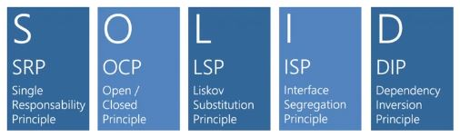

## Princípios SOLID

Neste módulo, abordaremos SOLID e alguns aspectos mais avançados de Injeção de Dependências. Voltando aos princípios da Programação Orientada a Objetos (POO), SOLID é um tema essencial que não pode ser ignorado. Esses princípios devem ser compreendidos, dominados e aplicados constantemente, pois fazem parte do fundamento da POO e não são opcionais, como um padrão de projeto que você decide aplicar apenas em alguns casos.

### O que é SOLID?

SOLID é um acrônimo que representa os cinco princípios fundamentais da POO e do design de código. Esses princípios foram identificados por Robert C. Martin (Uncle Bob) por volta do ano 2000. Ele não os criou, mas os observou e unificou como uma regra de ouro para escrever código limpo, flexível e escalável. O nome SOLID surge da combinação das iniciais desses princípios.

Os princípios SOLID devem ser aplicados para extrair os reais benefícios da Programação Orientada a Objetos. Simplesmente escrever código orientado a objetos sem utilizar SOLID não trará vantagens reais. Além disso, o SOLID não pode ser aplicado parcialmente, ou seja, não adianta escolher apenas o S ou o L e ignorar os demais. Eles são complementares e devem ser utilizados em conjunto para garantir um código bem estruturado.

### Benefícios do SOLID

Ao aplicar os princípios SOLID, seu código terá diversas vantagens, tais como:

- **Facilidade de manutenção e adaptação a mudanças de escopo**

A maior dificuldade no desenvolvimento de software é lidar com mudanças constantes. O mercado evolui rapidamente, e um software bem escrito precisa acompanhar essa evolução. Sem SOLID, pequenas alterações podem se tornar extremamente complexas, dificultando entregas rápidas e eficientes.

- **Código testável e de fácil entendimento**

Se um código não é testável, significa que não foi bem escrito. Código de qualidade permite testes unitários eficientes e deve ser fácil de ler e entender. O mito de que “um bom programador escreve código que só ele entende” é completamente falso. Código bem escrito é como um livro: tem contexto e expressividade.

- **Extensibilidade com mínimo esforço**

Alterar uma funcionalidade não deve exigir mudanças em toda a aplicação. Se uma pequena alteração exige uma reestruturação completa, isso indica acoplamento excessivo e falta de aplicação dos princípios SOLID.

- **Máximo reaproveitamento de código**

Um dos objetivos da POO é o reaproveitamento. Se o código não permite reutilização, ele foi mal projetado. SOLID ajuda a criar estruturas reutilizáveis, evitando retrabalho e código duplicado.

- **Longevidade do software**

Um software bem escrito permanece utilizável por muitos anos. Se a cada pequena mudança ele precisa ser reescrito do zero, algo está errado. Um bom design permite que a aplicação evolua sem a necessidade de refatorações drásticas.

### Problemas comuns evitados com SOLID

Além dos benefícios, SOLID também ajuda a evitar diversos problemas recorrentes no desenvolvimento de software. Vamos abordar alguns dos mais comuns:

- **Dificuldade na testabilidade e criação de testes unitários**

Se um código não pode ser testado facilmente, ele provavelmente não segue boas práticas. O SOLID ajuda a escrever código modular, desacoplado e fácil de testar.

- **Código desorganizado e sem estrutura**

Código macarrônico, difícil de manter e entender, geralmente não segue os princípios SOLID. Se você se deparar com esse tipo de código, provavelmente houve falhas na implementação dos princípios.

- **Dificuldade em isolar funcionalidades**

Se uma aplicação depende excessivamente de classes interconectadas, torna-se difícil isolar funcionalidades para manutenção e reaproveitamento. Um código bem estruturado deve permitir que cada classe seja responsável apenas pelo que foi projetada para fazer.

- **Duplicação de código**

A duplicação de código é um grande problema e deve ser evitada ao máximo. Sempre que um código é copiado e colado em vários pontos, uma simples alteração pode exigir modificações em toda a aplicação, aumentando o risco de erros e inconsistências.

Por que a duplicação acontece? Muitas vezes, o programador não quer mexer no código original por medo de quebrar algo, então cria uma cópia e faz modificações. Esse hábito compromete a manutenção e escalabilidade do software. SOLID ajuda a estruturar o código corretamente para evitar esse problema.

- **Código frágil e quebrável**

Código frágil é aquele que quebra facilmente após uma pequena alteração. Isso ocorre, principalmente, por acoplamento excessivo e falta de organização. Por exemplo, modificar o cadastro de clientes e, de repente, quebrar o módulo de pedidos indica que as classes estão mal projetadas e que há dependências desnecessárias entre elas.

SOLID resolve esse problema ao estabelecer fronteiras bem definidas entre responsabilidades, garantindo que cada classe tenha um único propósito e possa ser alterada sem impactar outras partes do sistema.

### Conclusão

O SOLID é um conjunto de princípios essenciais para a escrita de código limpo e bem estruturado. Embora não seja o único conjunto de boas práticas, sua aplicação já melhora significativamente a qualidade do código e evita problemas comuns no desenvolvimento de software.

A partir dos próximos tópicos, iremos explorar cada um dos princípios SOLID em detalhes, além de aprofundar a aplicação prática da Injeção de Dependências para fortalecer ainda mais a flexibilidade e manutenção do código.

**Pratique e veja como SOLID pode transformar a qualidade do seu código!**

 

  
   <a href="poo.md">Voltar: Programação Orientada a Objetos - POO</a> 
   <a href="solid-srp.md">Avançar: SRP - Single Responsability Principle</a>   

